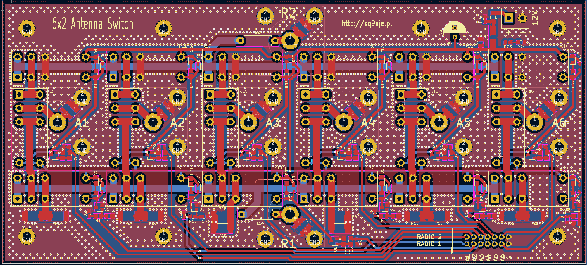

# Relay Module Hardware

This directory contains all hardware design files for the 6x2 Matrix Antenna Switch relay module, designed in KiCad.

## Overview

The relay module is a part of a 6x2 matrix antenna switch. It consists of six identical sections, one for each antenna. Each section allows connecting an antenna to Radio 1, Radio 2, or a 50-ohm dummy load (2W capacity). The design uses a popular three-relay configuration that prevents simultaneous connection of both transceivers to the same antenna while ensuring satisfactory isolation.

The relays are suitable for switching signals from transmitters at full amateur radio license power (1.5kW). All antenna ports are protected with gas discharge tubes (GDTs) to help protect radio inputs from high voltages generated during nearby lightning strikes or electrostatic charge buildup in antennas. However, the switch should not be considered a complete lightning protection solution.

**📋 [View Schematic (PDF)](images/relay_module.pdf)**

**🔧 [Interactive BOM](https://htmlpreview.github.io/?https://github.com/sq9nje/matrix_antenna_switch/blob/master/relay_module/hardware/bom/ibom.html){:target="_blank"}**
